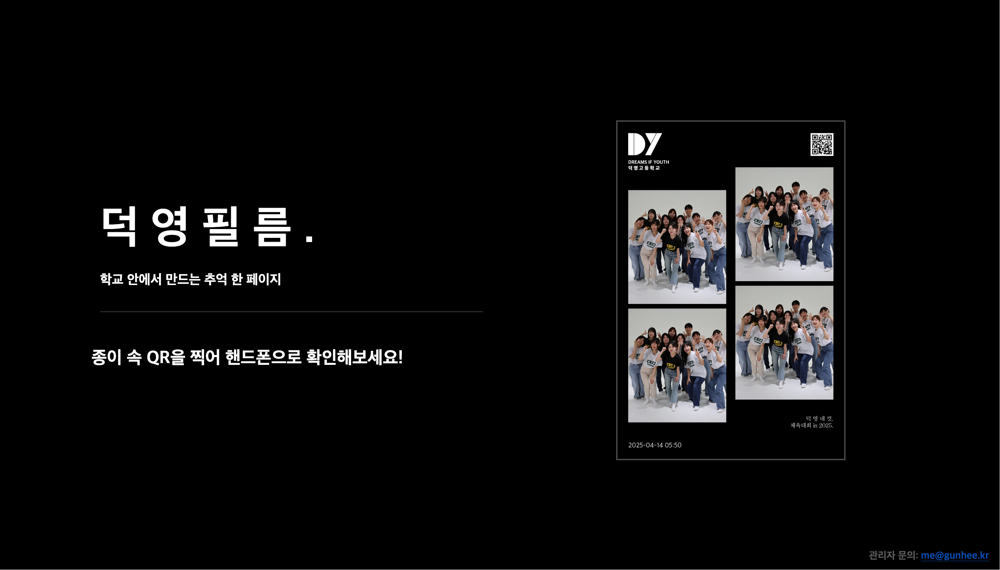
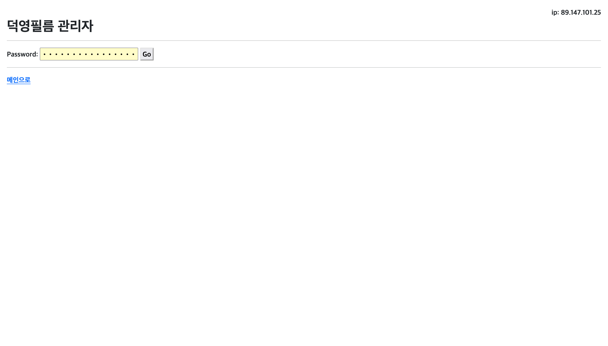
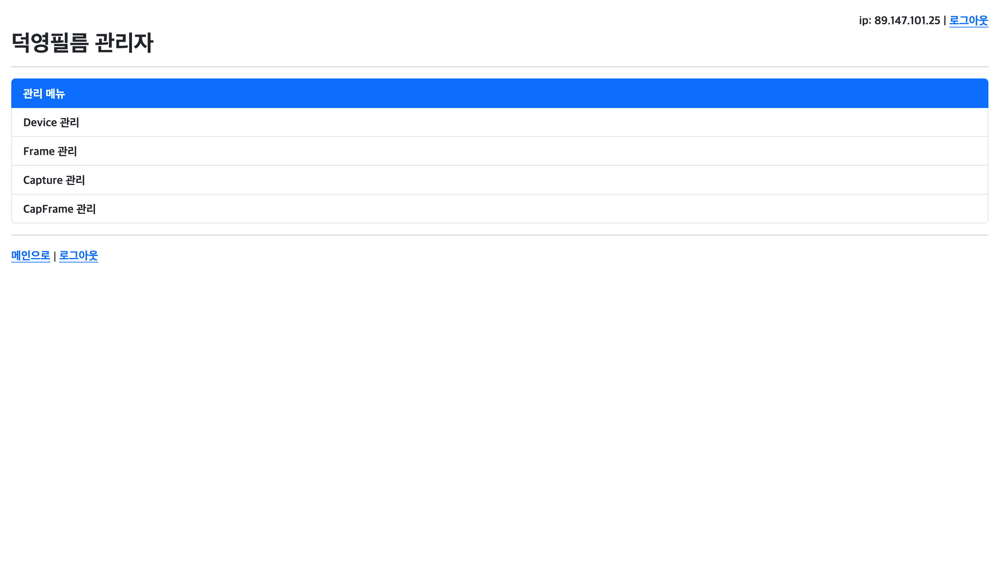
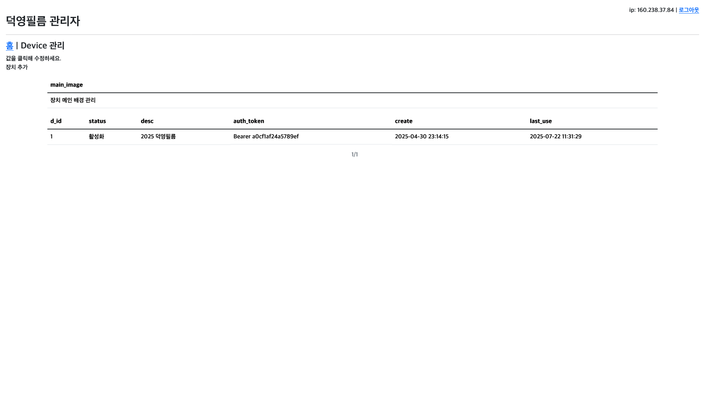

# dyfilm server v2.0
This is the 2025 Deokyoung Film server code. Compatible with [dyfilm client](https://github.com/szkotgh/dyfilm_client_v2.0).

## How to use
Use Python 3.10 or newer.

1. git clone
```sh
sudo git clone https://github.com/szkotgh/dyfilm_server_v2.0.git /opt/dyfilm_server_v2.0
cd /opt/dyfilm_server_v2.0
```

2. Native library installation

`python-magic` requires the native `libmagic` library, which pip does not install. Run the command for your operating system.

Ubuntu / Debian:

```sh
sudo apt-get update
sudo apt-get install libmagic1
```

macOS (with Homebrew installed):

```sh
brew install libmagic
```

See the [python-magic installation guide](https://pypi.org/project/python-magic/).

3. Python package installation

Install these packages into the Python environment used to run the server (`python3` in `stater.sh`).

```sh
python3 --version  # Python 3.10 or newer
python3 -m pip install -r requirements.txt
python3 -m pip check
python3 -c "import magic; print(magic.from_buffer(b'dyfilm server', mime=True))"
```

The checks should report `No broken requirements found.` and `text/plain` respectively. The second check also confirms that `libmagic` can be loaded.

`requirements.txt` lists only direct application dependencies; pip installs their dependencies automatically. Ubuntu system packages and server tools such as Certbot are managed separately, not through this file. Avoid replacing it with `pip freeze` from the system Python environment.

4. `.env` setup <br>
Please refer to [.env.example](.env.example) and configure appropriately.

5. service installation (Ubuntu / Debian)

Create the service account and grant it access to `/opt/dyfilm_server_v2.0`. The service's `WorkingDirectory` and `ExecStart` use this installation path.

```sh
sudo useradd -r -s /bin/false dyfilm
sudo chown -R dyfilm:dyfilm /opt/dyfilm_server_v2.0
```

The service runs as `dyfilm`. Its `python3` must use the environment where the packages were installed. If using a virtual environment at `/opt/dyfilm_server_v2.0/.venv`, add the following under `[Service]` in `dyfilm_server.service` before installation:

```ini
Environment="PATH=/opt/dyfilm_server_v2.0/.venv/bin:/usr/local/bin:/usr/bin:/bin"
```

```sh
sudo bash /opt/dyfilm_server_v2.0/service_regi.sh
```

### Internal view
If you have successfully connected to the server, the screen below will appear.


Add `/admin` to the server URL to go to the admin page. Log in with the `ADMIN_PASSWORD` set in `.env`.


You can perform various management tasks on the administrator page.


To enable the client to access the server normally, generate a device token on the server, copy it, and replace the `auth_token` in the client's Settings with the copied token. Also, change the `process_url` to point to the server.

