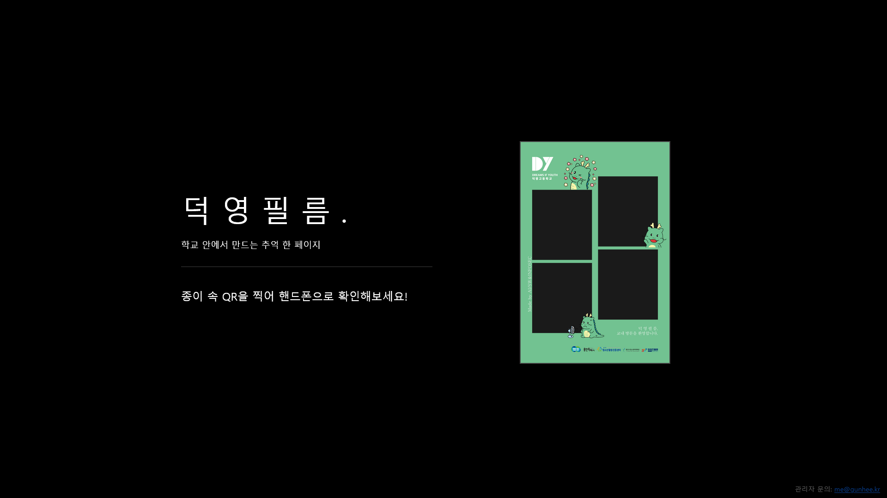
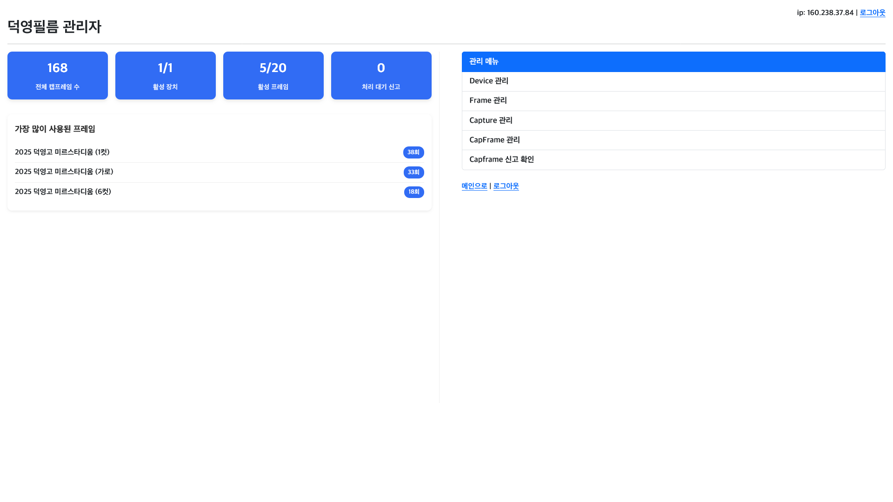

# dyfilm server v2.0
This is the 2025 Deokyoung Film server code. Compatible with [dyfilm client](https://github.com/szkotgh/dyfilm_client_v2.0).

## How to use
The Python version is mostly irrelevant, but `Python 3.10.12` is more stable.<br>

1. git clone
```sh
git clone https://github.com/szkotgh/dyfilm_server_v2.0.git
```

2. requirements.txt installation
```sh
sudo pip install -r requirements.txt
```

3. `.env` setup <br>
Please refer to [.env.example](.env.example) and configure appropriately.

4. service installation
```sh
sudo bash service_regi.sh
```

### Internal view
If you have successfully connected to the server, the screen below will appear.


Add `/admin` to the server URL to go to the admin page. Log in with the `ADMIN_PASSWORD` set in `.env`.


You can perform various management tasks on the administrator page.


To enable the client to access the server normally, generate a device token on the server, copy it, and replace the `auth_token` in the client's Settings with the copied token. Also, change the `process_url` to point to the server.
